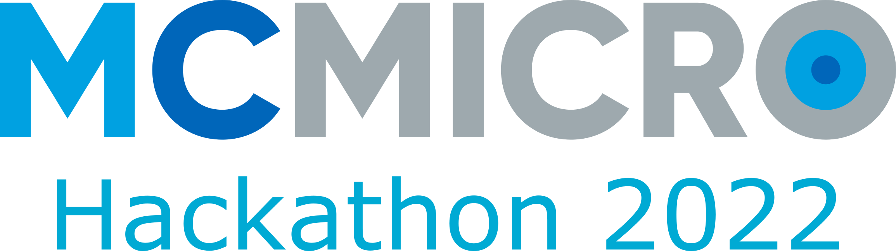

    <h2><i class="bi bi-calendar3"></i> Event timeline</h2>
    <dl>
        
            <dt>{{ site.registration_opens_date }}</dt>
            <dd>
                Applications open for participants 
                
                    <a href="{{ site.baseurl }}" class="btn">Register now</a>
                
                    <a class="btn disabled">Registration has closed</a>
                
                    <a class="btn disabled">Registration opens soon</a>
                
            </dd>
        

        <dt>{{ site.event_date }}</dt>
        <dd>Hackathon date</dd>
    </dl>



  
We are excited to announce our first ever MCMICRO hackathon in Heidelberg, brought to you by the Schapiro lab. The Hackathon will take place at the Marsilius Arkaden (Im Neuenheimer Feld 130.3, room K1, 69120 Heidelberg).

On this web page, you can find general information regarding the hackathon, like the [agenda](agenda.md), the [participants](about.md) as well as the [projects](projects.md) that we will be working on, as well as some [training resources](resources.md) about nextflow.

For more information on MCMICRO, please visit the [official MCMICRO main page](https://mcmicro.org/).



# Sponsors
  

Coffee and food for this event are sponsored by Lunaphore technologies [https://lunaphore.com/](https://lunaphore.com/).



The first ever MCMICRO hackathon was a great success!


